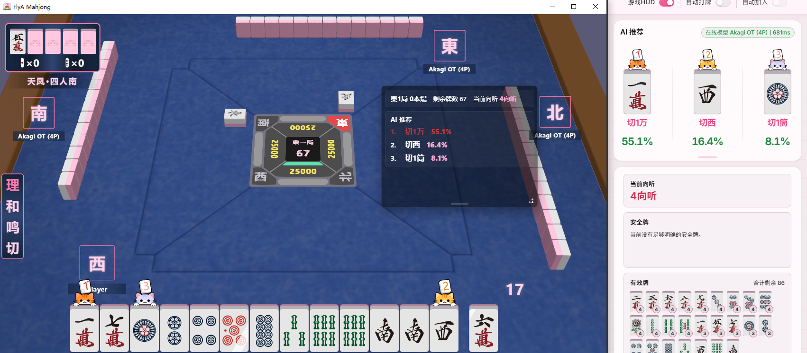

  
  <h1>FlyA Agent</h1>
  
基于 FlyA AI 的日本麻将智能体桌面软件

  

    <strong>简体中文</strong> | <a href="README_zh-TW.md">繁體中文</a> | <a href="README_en.md">English</a> | <a href="README_ja.md">日本語</a>
  

---

## 起源

嗨，这是一款全新的立直麻将教学软件。

说来话长——我一直想找一款能真正教我打麻将的工具。但翻遍了市面上的软件和模型，总觉得差点意思：牌效计算器（mahjong-helper 那类）能算向听数、有效牌、打点这些确定性数据，但也仅此而已——你知道了牌效，却还是不知道整体思路是什么；模型加载器（Akagi 那类）背后跑的是 Mortal 之类的神经网络，确实很强，但它像个黑盒——你看到推荐结果，却不知道它在"想"什么。这种感觉就像抄作业，抄完了还是不会做。

我希望 AI 不仅能给出推荐，还能告诉我"我为什么推荐这张"——这个"为什么"不是事后分析出来的马后炮，而是模型在推理时**直接输出**的内在判断。比如它觉得当前局面有多危险、推进的信心有多大、这一手的动机到底是进攻还是防守——这些都是模型自己"说"出来的，不是靠规则反推拼凑的。

于是我从公司逮捕了几个小伙伴，一起踏上了神经网络这条不归路（逃

顺便说一下我们的模型。FlyA 采用纯人类棋谱行为模仿作为基座训练，架构上用的是 CNN + Transformer，让模型具备注意力机制、长时序感知和对手推测能力。在此基础上，我们引入了 CFR（反事实遗憾最小化）算法做行为优化，再配合自对弈强化，整个训练分成多个阶段逐步推进。训练早期阶段的纯行为模仿基座模型，就已经在 RiichiLab 上拿过第一了——后面还有 CFR 和自对弈强化等阶段，值得期待。

另外，我们在网络架构上做了一些……比较离谱的优化，使得模型只需要很少量的牌谱就能提取出深层的麻将策略。所以请放心，我们不会采集您的对局数据——因为说实话，我们也用不着那么多牌谱 :)

欢迎加入我们的 Discord / QQ 群关注模型训练动态和软件发布进展——主要是会发免费 Key，我们会大撒币的！

## 简介

**FlyA Agent** 是一款基于 FlyA AI 的日本麻将智能体桌面软件，集实时教学、内置对局、自动化操作于一体。

你可以拿它接入雀魂等立直麻将游戏，实时看到 AI 的推荐和思考过程。我们甚至往里面塞了一个完整的麻将游戏，就为了让你能直接跟 AI 对打练习：

FlyA 模型的核心特色在于**可解释性**——威胁感知、推进信心、决策动机，这些都是模型推理过程中原生输出的信号，不是后期加工的结果。

> **当前版本是早期测试版**，Bug 肯定是有的。如果介意的话，建议别拿上分心切的大号来体验 :)

## 下载安装

前往 [Releases](../../releases/latest) 页面下载最新版本：

| 文件 | 说明 |
|------|------|
| `FlyA-Agent-*-win-x64-setup.exe` | Windows 安装包（推荐） |
| `FlyA-Agent-*-win-x64.zip` | Windows 便携版（免安装，解压即用） |

**系统要求**：Windows 10/11 (x64)，需联网（AI 推理为云端服务）

软件用 Go 和 Rust 写的，静态编译，不依赖任何运行时，装上就能跑。如果你遇到还需要装依赖的情况，那肯定是我们的锅，请告诉我们。

## 快速上手

1. 安装或解压后，启动 **FlyA Agent**
2. 使用测试 Key 登录（见下方说明）
3. 在主页「快速开始」卡片中选择游戏平台：
   - **雀魂网页版**：通过软件内置的指纹浏览器启动，不会泄露你的浏览器指纹
   - **客户端版**（雀魂客户端、一番街等）：点击「启动代理」，给一下管理员权限，软件会自动搞定证书和虚拟网卡
   - 也可以选择**手动装证书 + 用自己的代理**接入，这样不需要管理员权限

## 关于模型与登录

测试版支持两种登录方式：
- **Akagi OT2 Key**
- 我们**不定期发放的测试 Key**

需要说明的是，可解释性（威胁感知、推进信心、决策动机）是 FlyA 自研模型推理时直接输出的结果，并非外挂的规则分析。使用 OT 模型时不支持此功能，但基础的向听数、安全牌、有效牌等确定性计算仍然可用。

## 支持平台

| 平台 | 状态 |
|------|------|
| 雀魂网页版（全区服） | ✅ 已支持 |
| 雀魂客户端（全区服） | ✅ 已支持 |
| 麻雀一番街 | ✅ 已支持 |
| 天凤、雀姬等 | 🔧 适配中 |

软件支持**简体中文、繁体中文、日本語、English** 四种语言。翻译有问题随时告诉我们。

## 代理与权限

客户端代理模式用的是我们自研的代理引擎，通过虚拟网卡接管游戏流量。第一次用需要给管理员权限：

- 安装信任证书
- 创建虚拟网卡

搞定一次之后就不用再授权了，代理会在后台静默运行。实在不放心的话，也可以手动装证书、用自己的代理工具。

> ⚠️ 因为用了虚拟网卡（TUN 模式），所以没法和 Clash、V2RayN 之类同样用 TUN 的代理软件同时跑。用之前先把它们关了，或者切成系统代理模式就好。

## HUD 提示

HUD 浮窗默认对截图不可见（防止直播/录屏时泄露）。需要截图反馈 Bug 的话，去「设置 > HUD」打开截图可见性。

## 隐私与安全

- **数据安全**：软件不会篡改游戏数据，不会偷偷上传你的隐私信息。我们也不需要玩家数据来训练模型。
- **封号风险**：我们自己的测试号目前全部健在。但如果你拿它长时间挂机连打，那被封了也不奇怪——请合理使用。
- **闭源策略**：为了防止滥用、保护用户安全，软件会长期闭源，不会大规模免费开放。代码完全自研，没用过任何同类软件的源码。当然，软件本体也不是核心竞争力，我也懒得加太重的壳影响性能。
- **杀毒误报**：当前版本用的是常规构建流程，误报概率已经很低了。如果还遇到，请告诉我们。

## 关于更新

说实话，早期版本后续可能不太会频繁更新了。我们的模型架构最近变化比较大，目前软件是以"桥接"的方式在用模型。换引擎基本等于把整条链路重构一遍，所以计划是：先发一个差不多能用的版本，然后暂停更新，集中精力搞新模型的适配。

## 联系方式

| 渠道 | 链接 |
|------|------|
| Discord（FlyA Agent） | https://discord.gg/hUwMGczz |
| Discord（shinkuan's Akagi） | https://discord.gg/Z2wjXUK8bN |
| QQ 群 | 1093245435 |

## 免责声明

本软件仅供立直麻将教学与学习交流使用。我们反对拿它去挂机连打、刷分。我们做这个的初衷，就是想搞一款真正能帮人学麻将的东西——所以软件里塞了很多教学元素，模型也是基于可解释的动机策略训练的。用这个软件干了啥，后果自负哈。

---

本软件为闭源商业软件，保留所有权利。详见 [LICENSE](LICENSE)。
