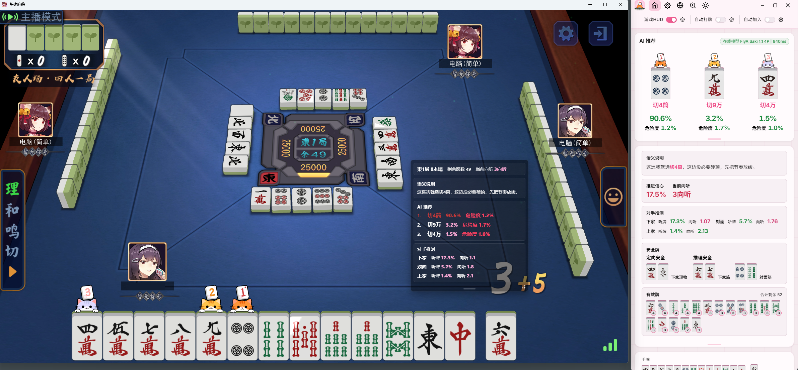

  
  <h1>FlyA Agent</h1>
  
A Japanese Riichi Mahjong AI Desktop Application Powered by FlyA AI

  

    <a href="README.md">简体中文</a> | <a href="README_zh-TW.md">繁體中文</a> | <strong>English</strong> | <a href="README_ja.md">日本語</a>
  

---

## Origin

Hey there — this is a brand-new Riichi Mahjong teaching tool.

Here's the story: I've always wanted software that could actually *teach* me how to play mahjong. But after trying everything out there, nothing quite clicked. Tile efficiency calculators (like mahjong-helper) can compute shanten count, effective tiles, and expected points — solid deterministic data, but that's all they do. You know the numbers, but you still don't understand the bigger picture. Model loaders (like Akagi) run neural networks like Mortal under the hood — genuinely powerful, but they're black boxes. You see the recommendation, but you have no idea what the model is "thinking." It's like copying someone's homework: you get the result, but you still can't solve the problem yourself.

What I wanted was an AI that doesn't just recommend a tile, but tells me *why* it recommends that tile — and not as some after-the-fact analysis bolted on top, but as something the model **natively outputs** during inference. Things like how dangerous the current situation feels, how confident it is about pushing forward, whether the play is offensive or defensive — these are signals the model produces on its own, not reverse-engineered from rules.

So I kidnapped a few colleagues from the office, and together we went down the neural network rabbit hole. No regrets. Okay, maybe some regrets.

A bit about our model: FlyA starts with pure behavioral cloning on human game records as a foundation. The architecture is CNN + Transformer, giving the model attention mechanisms, long-horizon awareness, and opponent modeling. On top of that, we use CFR (Counterfactual Regret Minimization) for policy refinement, combined with self-play reinforcement learning. Training happens in multiple stages. The base model from the earliest stage — pure behavioral cloning alone — already hit #1 on RiichiLab. And that's before CFR and self-play reinforcement even kick in. Stay tuned.

Oh, and we pulled off some... let's call them *unreasonably effective* optimizations to the network architecture, which means the model can extract deep mahjong strategies from a surprisingly small amount of game data. So rest assured — we won't be harvesting your match data. Honestly, we don't even need that much :)

Join our Discord / QQ group to follow model training updates and software releases — mainly because we'll be giving away free keys. We're going full Oprah on this one!

## Introduction

**FlyA Agent** is a Japanese Riichi Mahjong AI desktop application powered by FlyA AI, combining real-time teaching, built-in games, and automation.

You can connect it to Mahjong Soul and other Riichi Mahjong platforms to watch AI recommendations and reasoning in real time. You can also play against AI opponents in the built-in mahjong game. The core feature of the FlyA model is **explainability** — threat perception, push confidence, and decision motivation are all signals natively produced during model inference, not post-hoc analysis.

> **This is an early beta.** Bugs are guaranteed. If that bothers you, maybe don't use your tryhard ranked account :)

## Download

Head to the [Releases](../../releases/latest) page for the latest version:

| File | Description |
|------|-------------|
| `FlyA-Agent-*-win-x64-setup.exe` | Windows installer (recommended) |
| `FlyA-Agent-*-win-x64.zip` | Windows portable (no installation needed) |

**Requirements**: Windows 10/11 (x64), internet connection required (AI inference is cloud-based)

Built with Go and Rust, statically compiled — zero runtime dependencies, just install and go. If you run into a situation where you need to install something extra, that's definitely our fault. Let us know.

## Quick Start

1. Install or extract, then launch **FlyA Agent**
2. Log in with a test key (see below)
3. Pick your game platform from the "Quick Start" card on the home page:
   - **Mahjong Soul (Web)**: Launches via the built-in fingerprint browser — your browser fingerprint stays private
   - **Desktop clients** (Mahjong Soul client, Ichiban-gai, etc.): Click "Start Proxy", grant admin permission, and the software handles certificates and virtual adapter setup automatically
   - You can also go with **manual certificate installation + your own proxy** — no admin needed

## Models & Login

The beta supports two login methods:
- **Akagi OT2 Key**
- **Test keys** we hand out from time to time

Important note: explainability (threat perception, push confidence, decision motivation) comes directly from the FlyA model's inference output — it's not a rule-based overlay. OT models don't support this feature, but basic deterministic calculations like shanten count, safe tiles, and effective tiles still work.

## Supported Platforms

| Platform | Status |
|----------|--------|
| Mahjong Soul Web (all regions) | ✅ Supported |
| Mahjong Soul Client (all regions) | ✅ Supported |
| Ichiban-gai | ✅ Supported |
| Tenhou, Queji, etc. | 🔧 In progress |

The software supports **Simplified Chinese, Traditional Chinese, Japanese, and English**. Translation issues? Let us know.

## Proxy & Permissions

The client proxy uses our proprietary proxy engine, routing game traffic through a virtual network adapter. First-time use requires admin permission to:

- Install a trusted certificate
- Create a virtual network adapter

One-time setup — after that, the proxy runs silently in the background. If you'd rather not, you can manually install the certificate and use your own proxy tool.

> ⚠️ Since we use TUN mode, it can't coexist with other TUN-mode proxy tools (Clash, V2RayN, etc.). Close them or switch to system proxy mode first.

## HUD Note

The HUD overlay is hidden from screenshots by default (to prevent leaks during streaming/recording). If you need to capture HUD screenshots for bug reports, enable screenshot visibility in Settings > HUD.

## Privacy & Security

- **Data safety**: The software doesn't tamper with game data or secretly upload your information. We don't need your data for model training either.
- **Ban risk**: All our test accounts are still alive and kicking. But if you use it for prolonged inhuman auto-play, don't be surprised if you get banned — use responsibly.
- **Closed source**: To prevent abuse and protect users, the software stays closed-source and won't be made widely available for free. Entirely self-developed — no code borrowed from similar software. That said, the software itself isn't the secret sauce. I'm also too lazy to slap on heavy DRM that'd tank performance.
- **Antivirus**: Current builds use a standard pipeline, so false positives should be rare. If you still get flagged, let us know.

## Update Policy

Real talk — early versions probably won't get frequent updates going forward. Our model architecture has been changing significantly, and the software currently talks to the model through a "bridge" layer. Swapping out the engine basically means rewriting the entire pipeline, so the plan is: ship a reasonably usable version, then go heads-down on adapting to the new model.

## Contact

| Channel | Link |
|---------|------|
| Discord (FlyA Agent) | https://discord.gg/hUwMGczz |
| Discord (shinkuan's Akagi) | https://discord.gg/Z2wjXUK8bN |
| QQ Group | 1093245435 |

## Disclaimer

This software is for Riichi Mahjong education and learning only. We're against using it for inhuman auto-play, rank boosting, or any form of abuse. We built this because we genuinely wanted a tool that helps people learn mahjong — the software is packed with teaching features, and the model is trained on explainable motivational strategies. Whatever you do with it, that's on you.

---

This software is proprietary and closed-source. All rights reserved. See [LICENSE](LICENSE).
